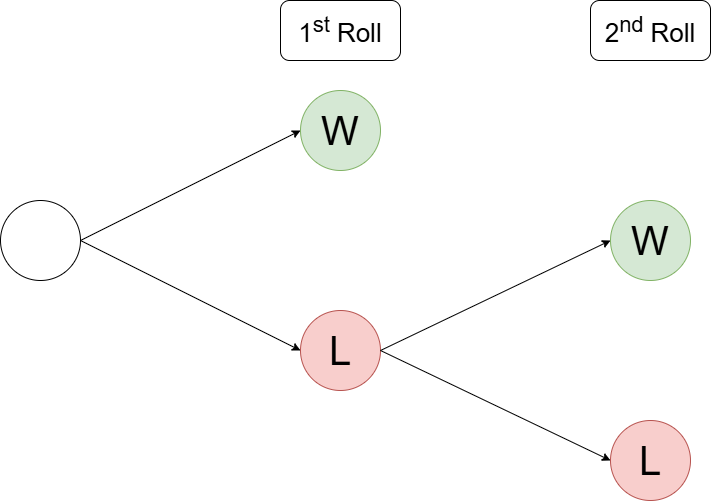
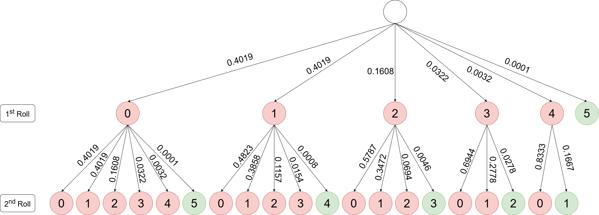

# Dice Probability and Fairness in Multiple Rerolls

- [Introduction](#introduction)
- [Probability Models](#probability-models)
- [Bernoulli Model](#bernoulli-model)
- [Binomial Model](#binomial-model)
- [Probability Analysis](#probability-analysis)
- [Fairness Analysis](#fairness-analysis)
- [Concludion](#conclusion)
- [Chinese Version (中文版本)](README_CN.md)

## Introduction
I recently watched a TV show where players were required to roll 5 pieces of six-sided dice, each of which had one side with a car symbol. To win, all five dice needed to show the car symbol face up. If any dice failed to show the car symbol on the first roll, players were allowed to reroll those dice to increase their chances of winning.

As a mathematics enthusiast, I wanted to calculate the probability of winning in this game and conduct a simple analysis on strategies to improve the winning odds.

## Probability Models
To win, each die must show the car symbol. Since each die has six faces, the probability of winning for a single die is $p=\frac{1}{6}$, while the probability of losing is $1-p=\frac{5}{6}$.

I found two methods to calculate the winning probability with 5 dices:
1. Treat each roll as independent and use a Bernoulli model. First, calculate the probability of a single die showing the car symbol, then raise this probability to the fifth power for five dice.
2. Use a Binomial model to directly compute the probability of all five dice showing the car symbol in one calculation.

Although these two methods are different, both can help us analyze the probability of winning in the game.

## Bernoulli Model
By treating each roll as an independent event, we can first calculate the probability of winning for a single die. Below is the Probability Tree Diagram, which shows how players can increase their chances of winning by rerolling the dice that did not show the car symbol.

<kbd></kbd>

All the relevant probabilities can be derived using the Bernoulli model:
```math
P(X=k)={ {\begin{cases}
          1-p & {\text{if }}k=0 \\
          p   & {\text{if }}k=1
          \end{cases}}}
```
In this case, $k$ represents the success or failure of a single event, where $k=1$ indicates a win and $k=0$ indicates a loss. Therefore, the probabilities for a single die are:
```math
\begin{array}{r l}
P(X_1=1)=\frac{1}{6} & \text{Success on the First roll} \\ 
P(X_1=0)=\frac{5}{6} & \text{Failure on the First roll} \\
P(X_2=1|X_1=0)=\frac{1}{6} & \text{Success on the Second roll} \\
P(X_2=0|X_1=0)=\frac{5}{6} & \text{Failure on the Second roll}
\end{array}
``` 

<kbd></kbd>

The total win probability for a single die is:
```math
\begin{aligned}
P(\text{Win}) &= P(X_1=1) + P(X_2=1 \cap X_1=0) \\
&= P(X_1=1) + \left[P(X_2=1 \mid X_1=0) \times P(X_1=0)\right] \\
&= \dfrac{1}{6} + \left[\dfrac{1}{6} \times \dfrac{5}{6}\right] \\
&= \dfrac{11}{36}
\end{aligned}
```
Since each roll is an independent event, we can simply multiply the individual win probabilities of the 5 dice to obtain the total win probability:
```math
\begin{aligned}
P(\text{Win}) &= \left({\dfrac{11}{36}}\right)^5 \\
&\approx 0.00266
\end{aligned}
```
## Binomial Model
Actually, the binomial distribution model is an extension of the Bernoulli model. It treats the $n$ independent events as the total number of trials, with $k$ representing the total number of successful events. The probability can be calculated using the binomial distribution formula:
```math
P(X=k)={\binom{n}{k}p^{k}(1-p)^{n-k}}
```
Below is the probability tree diagram for the binomial distribution model.

<kbd></kbd>

Since we need to calculate each probability, I'll only demonstrate a few cases.

For example, the probability of getting one successful die in the first round is:
```math
\begin{aligned}
P(X_1=1) &= \dbinom{5}{1} \left(\dfrac{1}{6}\right)^{1} \left(\dfrac{5}{6}\right)^{4} \\
&= \dfrac{3125}{7776} \\
&\approx 0.4019
\end{aligned}
```
If we get one successful die in the first round, and then in the second round, we reroll the remaining 4 dice and all 4 dice show the car symbol:
```math
\begin{aligned}
P(X_2=4 \mid X_1=1) &= \dbinom{4}{4} \left(\dfrac{1}{6}\right)^{4} \left(\dfrac{5}{6}\right)^{0} \\
&= \dfrac{1}{1296} \\
&\approx 0.0008
\end{aligned}
```
Then, the joint probability of getting one successful die in the first round and four successful dice in the second round is: 
```math
\begin{aligned}
P(X_2=4 \cap X_1=1) &= P(X_2=4 \mid X_1=1) \times P(X_1=1) \\
&= \dfrac{3125}{7776} \times \dfrac{1}{1296} \\
&= \dfrac{3125}{10077696} \\
&\approx 0.0003
\end{aligned}
```
Other calculations have been completed using Excel, please refer to the following image:

<kbd></kbd>

<kbd></kbd>

Finally, by adding the joint probabilities of getting 5 cars over two rounds, with the probability of getting 5 cars directly in the first round, we get the total win probability:
```math
\begin{align*}
P(\text{Win}) &= P(X_1=5) \\
&\quad + P(X_2=5 \cap X_1=0) \\
&\quad + P(X_2=4 \cap X_1=1) \\
&\quad + P(X_2=3 \cap X_1=2) \\
&\quad + P(X_2=2 \cap X_1=3) \\
&\quad + P(X_2=1 \cap X_1=4) \\
&\approx 0.000129 + 0.000536 + 0.000893 + 0.000744 + 0.000310 + 0.000052 \\
&= 0.002663
\end{align*}
```
## Probability Analysis
From a probabilistic perspective, this game is indeed very unfavorable for players. To win, all 5 dice must show the car symbol, and even with two chances, the probability of achieving this is still extremely low. We can look at the specific win rates to illustrate why this game feels somewhat "unfair."

Firstly, the probability of all 5 dice showing the car symbol in the first roll is very low, only about $0.0129\\%$. Although the second roll provides an opportunity to increase the win rate slightly, the improvement remains limited. Even if all the dice in the second roll show the car symbol, the probability of a full success is still very small. Our calculations show that the total win probability is around $0.2663\\%$.

In other words, the expected win rate is very low; $0.2663\\%$ means that you'd need to play about **375** rounds of this game to expect a single win. Although having two rolls might give players a sense that winning is more fair or "more likely", but the actual increase in probability is very minimal.

Additionally, in this game, the chance of failure is quite high. That is, players have nearly a 50% chance of not getting a single successful die even in the first round. Below are the results calculated based on the binomial distribution model:
```math
\begin{align*}
P(X_1=0) &\approx 0.4019 \\
P(X_2=0 \mid X_1=4) &\approx 0.8333 \\
P(X_2=0 \mid X_1=3) &\approx 0.6944 \\
P(X_2=0 \mid X_1=2) &\approx 0.5787 \\
P(X_2=0 \mid X_1=1) &\approx 0.4823 \\
P(X_2=0 \mid X_1=0) &\approx 0.4019
\end{align*}
```
This demonstrates that, regardless of whether it’s in the first or second roll, the probability of not achieving the car symbol on the dice is about 50% or even higher, making the risk of failure very high.

In summary, the design of this game makes winning almost impossible. This game could indeed be considered “unfair” as it gives players the impression that winning is just somewhat difficult, while in reality, the probability is extremely low.
## Fairness Analysis
After saying all this, everyone should be able to tell that this game is nearly unplayable. Now, I am starting to wonder: with the same gameplay and conditions, how many rerolls should be given to the player in order to make the game's win rate fair to the player? We can set a $50\\%$ win rate as the fair standard for the game.

To simplify the analysis, let's first calculate the probability of a single die roll being successful. Using the probability distribution of the Bernoulli model, if there is only one roll (i.e., $i=1$), the overall win rate will be:
```math
\begin{aligned}
P(\text{Win}_1) &= P(X_1=1) \\
&= \dfrac{1}{6}
\end{aligned}
```
If a second reroll opportunity is given (i.e., $i=2$), then the total win rate will be:
```math
\begin{aligned}
P(\text{Win}_2) &= P(X_1=1) + P(X_2=1 \cap X_1=0) \\
&= \dfrac{1}{6} + \left(\dfrac{5}{6} \times \dfrac{1}{6} \right)
\end{aligned}
```
If a third reroll opportunity is given (i.e., $i=3$), then the total win rate will be:
```math
\begin{aligned}
P(\text{Win}_3) &= P(X_1=1) + P(X_2=1 \cap X_1=0) + P(X_3=1 \cap X_2=0 \cap X_1=0) \\
&= \dfrac{1}{6} + \left(\dfrac{5}{6} \times \dfrac{1}{6} \right) + \left(\dfrac{5}{6} \times \dfrac{5}{6} \times \dfrac{1}{6} \right) \\
&= \dfrac{1}{6} + \left(\dfrac{5}{6} \times \dfrac{1}{6} \right) + \left(\left(\dfrac{5}{6}\right)^{2} \times \dfrac{1}{6} \right)
\end{aligned}
```
Continuing in this way, if a $k$-th reroll opportunity is given (i.e., $i=k$), then the total win rate will be:
```math
\begin{aligned}
P(\text{Win}_k) &= P(X_1=1) + P(X_2=1 \cap X_1=0) + \dots + P(X_k=1 \cap \dots \cap X_1=0) \\
&= \dfrac{1}{6} + \left(\dfrac{5}{6} \times \dfrac{1}{6} \right) + \dots + \left(\left(\dfrac{5}{6}\right)^{k-1} \times \dfrac{1}{6} \right)
\end{aligned}
```
This expression is actually a geometric progression, so we can further simplify the formula:
```math
\begin{align*}
S_n&=a+ar+\dots+ar^{n-1} \\
&=\dfrac{a(1-r^{n})}{1-r} & , \quad r \neq 1 \text{ and } r<1
\end{align*}
```
Based on our formula, the first term $a=\frac{1}{6}$ , the common ratio $r=\frac{5}{6}$ , and the number of terms $n=k$. Substituting these variables into the formula for the sum of a geometric series, we get:
```math
\begin{aligned}
P(\text{Win}_k) &= \dfrac{\dfrac{1}{6}\left(1-\left(\dfrac{5}{6}\right)^{k}\right)}{1-\dfrac{5}{6}} \\
&= 1-\left(\dfrac{5}{6}\right)^{k}&, \quad k \in \mathbb{Z}^+ 
\end{aligned}
```
The above gives the expected win rate for a single die when $k$ rolls are allowed. Next, let's calculate how many rerolls should be allowed in the case of five dice, in order to ensure that the success probability is at least $50\\%$. 
```math
\begin{align*}
P(\text{Win}_k) &\ge 0.5 \\
\left(1-\left(\dfrac{5}{6}\right)^{k}\right)^{5} &\ge 0.5 \\
\left(\dfrac{5}{6}\right)^{k} &\le 1-\sqrt[5]{0.5} \\
k \cdot \ln{\left(\dfrac{5}{6}\right)} &\le \ln{(1-\sqrt[5]{0.5})} \\
k &\ge \dfrac{\ln{(1-\sqrt[5]{0.5})}}{\ln{\left(\dfrac{5}{6}\right)}} \\
k &\ge 11.2135 \\
k & = 12
\end{align*}
```
As can be seen, the success probability will exceed 50% only when the player is given at least **12** reroll opportunities, making the game fair to the player. The following chart shows the expected win rate for different numbers of dice (from 1 to 5 dice, denoted as $x$) when $k$ rerolls are allowed.
```math
f(x,k)=\left(1-\left(\dfrac{5}{6}\right)^{k}\right)^{x}
```

<kbd></kbd>

## Conclusion
Our analysis reveals that the probability of winning this game, which requires players to roll five dice to show car symbols within two rounds, is extremely low—approximately 0.2663%. Although two re-roll opportunities are provided, their effect on the win rate is minimal. While the design appears to increase the player's chances, the actual probability of winning remains very low. For a fairer gaming experience, the number of re-rolls would need to be increased to at least 12.

Of course, as the game carries a degree of gambling risk, the organizers are unlikely to raise the win probability to a fair level for players. Whether you want to try your luck is entirely up to you. This analysis is purely for academic discussion and does not constitute any advice; the author assumes no responsibility for any outcomes resulting from it. Any questions or suggestions are welcome — please feel free to open an issue for further discussion.