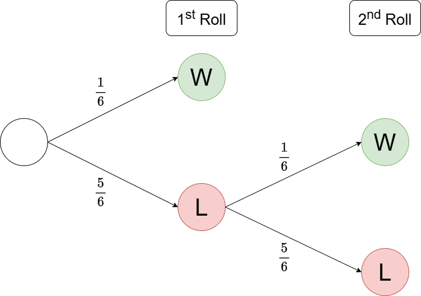
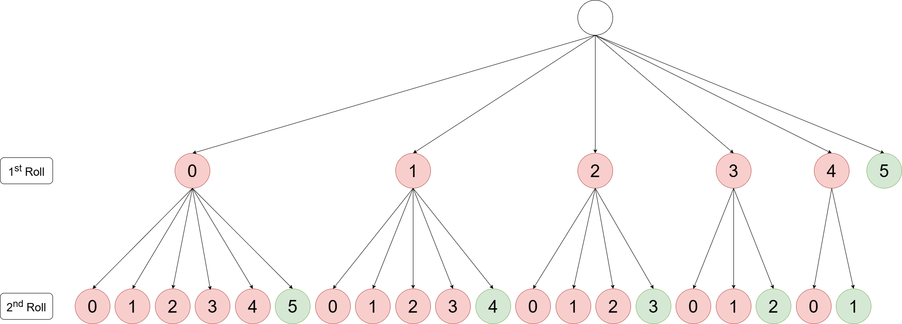

# 多次重掷中的骰子概率与公平性

- [引言](#引言)
- [概率模型](#概率模型)
- [伯努利模型](#伯努利模型)
- [二项分布模型](#二项分布模型)
- [概率分析](#概率分析)
- [公平性分析](#公平性分析)
- [总结](#总结)
- [英文版本 (English Version)](README.md)

## 引言
最近我看了一个电视节目，节目中的游戏规则是，玩家需要投掷5颗六面骰子，骰子上有一面绘有汽车图案。只有5颗骰子全部朝向汽车图案时，玩家才算获胜。如果第一轮投掷未能全部出现汽车图案，玩家可以重掷未显示汽车图案的骰子，以提高获胜几率。

作为一名数学爱好者，我想计算一下玩家的获胜概率，并进行一些简单的分析，探讨如何增加游戏的胜率。

## 概率模型
如果要获胜，每颗骰子必须朝向汽车图案。由于每颗骰子有六个面，朝向汽车图案的概率为 $p=\frac{1}{6}$，而不朝向汽车图案的概率则为 $1-p=\frac{5}{6}$ 

我发现计算5颗骰子获胜概率有两种方法：
1. 将每次投掷视为独立事件 (Independent Event)，使用伯努利模型（Bernoulli Model）计算单颗骰子投掷出汽车图案的概率，然后将结果的概率提升到5次方，即考虑5颗骰子同时获胜的情况。
2. 使用二项分布模型（Binomial Model），直接计算5颗骰子中全部朝向汽车图案的获胜概率。

这两种方法虽然不同，但都可以帮助我们分析游戏的胜率。

## 伯努利模型
通过将每次投掷视为独立事件，我们可以首先计算单颗骰子的胜率。以下是概率树图 (Probability Tree Diagram) ，展示了玩家如何通过重新投掷未显示汽车图案的骰子，以提高获胜的概率。

<kbd></kbd>

所有相关概率可以通过伯努利模型计算得到：
```math
P(X=k)={ {\begin{cases}
          1-p & {\text{if }}k=0 \\
          p   & {\text{if }}k=1
          \end{cases}}}
```

其中，$k$ 表示单次事件的成功或失败，$k=1$ 表示获胜，$k=0$ 表示失败。因此，单颗骰子的概率为：
```math
\begin{array}{r l}
P(X_1=1)=\frac{1}{6} & \text{第一轮成功的概率} \\ 
P(X_1=0)=\frac{5}{6} & \text{第一轮失败的概率} \\
P(X_2=1|X_1=0)=\frac{1}{6} & \text{第二轮成功的概率} \\
P(X_2=0|X_1=0)=\frac{5}{6} & \text{第二轮失败的概率}
\end{array}
``` 

<kbd></kbd>


单颗骰子的总胜率为：

$
\begin{aligned}
P(\text{Win}) &= P(X_1=1) + P(X_2=1 \cap X_1=0) \\
&= P(X_1=1) + \left[P(X_2=1 \mid X_1=0) \times P(X_1=0)\right] \\
&= \dfrac{1}{6} + \left[\dfrac{1}{6} \times \dfrac{5}{6}\right] \\
&= \dfrac{11}{36}
\end{aligned}
$

由于每次投掷都是独立事件，因此我们可以直接将5颗骰子的单次胜率相乘，得到总胜率为：

$
\begin{aligned}
P(\text{Win}) &= \left({\dfrac{11}{36}}\right)^5 \\
&\approx 0.00266
\end{aligned}
$

## 二项分布模型
实际上，二项分布模型是伯努利模型的扩展，它可以将 $n$ 个独立事件视为试验的总数，其中 $k$ 表示成功事件的总数。概率可以通过二项分布模型计算得到：
```math
P(X=k)={\binom{n}{k}p^{k}(1-p)^{n-k}}
```

以下是二项分布模型的概率树图。

<kbd></kbd>

由于需要算每个概率，这里就只演示算几个案列，

比如在第一轮得到一个成功骰子的概率是：

$
\begin{aligned}
P(X_1=1) &= \dbinom{5}{1} \left(\dfrac{1}{6}\right)^{1} \left(\dfrac{5}{6}\right)^{4} \\
&= \dfrac{3125}{7776} \\
&\approx 0.4019
\end{aligned}
$

如果在第一轮中得到一个成功的骰子，然后在第二轮重新投掷剩下的4颗骰子，并且这4颗骰子全部成功显示汽车图案：

$
\begin{aligned}
P(X_2=4 \mid X_1=1) &= \dbinom{4}{4} \left(\dfrac{1}{6}\right)^{4} \left(\dfrac{5}{6}\right)^{0} \\
&= \dfrac{1}{1296} \\
&\approx 0.0008
\end{aligned}
$

那么第一轮中得到一个成功的骰子，并在第二轮内获得四个成功骰子的联合概率是：

$
\begin{aligned}
P(X_2=4 \cap X_1=1) &= P(X_2=4 \mid X_1=1) \times P(X_1=1) \\
&= \dfrac{3125}{7776} \times \dfrac{1}{1296} \\
&= \dfrac{3125}{10077696} \\
&\approx 0.0003
\end{aligned}
$


其他的计算我已经用 Excel 完成了，请参考以下图片：

<kbd></kbd>

<kbd></kbd>

最终，将这两轮里共获得5颗汽车的联合概率与第一轮直接获得5颗汽车的概率相加，得到总胜率。
```math
\begin{align*}
P(\text{Win}) &= P(X_1=5) \\
&\quad + P(X_2=5 \cap X_1=0) \\
&\quad + P(X_2=4 \cap X_1=1) \\
&\quad + P(X_2=3 \cap X_1=2) \\
&\quad + P(X_2=2 \cap X_1=3) \\
&\quad + P(X_2=1 \cap X_1=4) \\
&\approx 0.000129 + 0.000536 + 0.000893 + 0.000744 + 0.000310 + 0.000052 \\
&= 0.002663
\end{align*}
```

## 概率分析
从概率上看，这个游戏对玩家确实非常不利。要赢得游戏，5个骰子都必须显示汽车图案，即便有两轮机会，这种情况的概率仍然极低。我们可以通过具体的胜率来解释为什么这个游戏有点“坑”。

首先，第一轮5个骰子全部显示汽车图案的概率非常低，仅约为 $0.0129\%$。尽管第二轮重掷的机会略微增加了胜率，但提升幅度仍然有限。即使在第二轮所有骰子都显示汽车图案，最终达到全成功的概率依然非常小。我们的计算显示，总体胜率大约为 $0.2663\%$。

换句话说，期望中的胜率非常低，$0.2663\%$ 意味着大约需要玩 **375** 次这样的游戏才能期望赢一次。虽然游戏设计成有两轮机会，可能让玩家感觉更公平或“更可能获胜”，但实际概率的提升非常有限。

此外，在这个游戏中，投掷失败的概率也很高，也是说，玩家有近一半的概率甚至在第一轮都拿不到一个成功的骰子。以下是根据二项分布模型计算的结果：
```math
\begin{align*}
P(X_1=0) &\approx 0.4019 \\
P(X_2=0 \mid X_1=4) &\approx 0.8333 \\
P(X_2=0 \mid X_1=3) &\approx 0.6944 \\
P(X_2=0 \mid X_1=2) &\approx 0.5787 \\
P(X_2=0 \mid X_1=1) &\approx 0.4823 \\
P(X_2=0 \mid X_1=0) &\approx 0.4019
\end{align*}
```

以上说明，无论是在第一轮还是第二轮的投掷中，未能获得汽车图案的骰子概率都在一半甚至更高，因此失败的风险非常大。总结来说，这个游戏的设计使得获胜几乎不可能。可以说，这种游戏确实有“坑人”的嫌疑，因为它让玩家误以为获胜只是有些困难，而实际胜率却极低。

## 公平性分析
说了这么多，大家应该都能看出这个游戏实在是几乎无法玩下去。那么我开始好奇，在相同的玩法和条件下，应该给予玩家多少次重掷机会，才能使游戏的胜率对玩家公平呢？我们可以设定 $50\%$ 的胜率作为游戏的公平标准。

为了简化分析，我们首先计算单颗骰子投掷成功的概率。通过伯努利模型的概率分布，如果只有一次投掷机会（即 $i=1$），那么总胜率将会是：

$
\begin{aligned}
P(\text{Win}_1) &= P(X_1=1) \\
&= \dfrac{1}{6}
\end{aligned}
$

如果给予第二次重掷的机会（即 $i=2$），那么总胜率将会是：

$
\begin{aligned}
P(\text{Win}_2) &= P(X_1=1) + P(X_2=1 \cap X_1=0) \\
&= \dfrac{1}{6} + \left(\dfrac{5}{6} \times \dfrac{1}{6} \right)
\end{aligned}
$

如果给予第三次重掷的机会（即 $i=3$），那么总胜率将会是：

$
\begin{aligned}
P(\text{Win}_3) &= P(X_1=1) + P(X_2=1 \cap X_1=0) + P(X_3=1 \cap X_2=0 \cap X_1=0) \\
&= \dfrac{1}{6} + \left(\dfrac{5}{6} \times \dfrac{1}{6} \right) + \left(\dfrac{5}{6} \times \dfrac{5}{6} \times \dfrac{1}{6} \right) \\
&= \dfrac{1}{6} + \left(\dfrac{5}{6} \times \dfrac{1}{6} \right) + \left(\left(\dfrac{5}{6}\right)^{2} \times \dfrac{1}{6} \right)
\end{aligned}
$

以此类推，如果给予第 $k$ 次重掷的机会（即 $i=k$），那么总胜率将会是：

$
\begin{aligned}
P(\text{Win}_k) &= P(X_1=1) + P(X_2=1 \cap X_1=0) + \dots + P(X_k=1 \cap \dots \cap X_1=0) \\
&= \dfrac{1}{6} + \left(\dfrac{5}{6} \times \dfrac{1}{6} \right) + \dots + \left(\left(\dfrac{5}{6}\right)^{k-1} \times \dfrac{1}{6} \right)
\end{aligned}
$

这个表达式实际上是一个等比数列（Geometric Progression），因此我们可以进一步简化这个算式：
```math
\begin{align*}
S_n&=a+ar+\dots+ar^{n-1} \\
&=\dfrac{a(1-r^{n})}{1-r} & , \quad r \neq 1 \text{ and } r<1
\end{align*}
```

根据我们的算式，首项 $a=\frac{1}{6}$，公比 $r=\frac{5}{6}$，且项数 $n=k$。将这些变量代入等比数列的求和公式中，我们得出：

$
\begin{aligned}
P(\text{Win}_k) &= \dfrac{\dfrac{1}{6}\left(1-\left(\dfrac{5}{6}\right)^{k}\right)}{1-\dfrac{5}{6}} \\
&= 1-\left(\dfrac{5}{6}\right)^{k}&, \quad k \in \mathbb{Z}^+ 
\end{aligned}
$

以上是单颗骰子在允许投掷 $k$ 次的期望胜率。接下来，让我们来计算，在五颗骰子的情况下，应该允许多少次重掷，才能使成功概率至少达到 $50\%$。
```math
\begin{align*}
P(\text{Win}_k) &\ge 0.5 \\
\left(1-\left(\dfrac{5}{6}\right)^{k}\right)^{5} &\ge 0.5 \\
\left(\dfrac{5}{6}\right)^{k} &\le 1-\sqrt[5]{0.5} \\
k \cdot \ln{\left(\dfrac{5}{6}\right)} &\le \ln{(1-\sqrt[5]{0.5})} \\
k &\ge \dfrac{\ln{(1-\sqrt[5]{0.5})}}{\ln{\left(\dfrac{5}{6}\right)}} \\
k &\ge 11.2135 \\
k & = 12
\end{align*}
```

由此可见，只有当玩家被给予至少 **12** 次重掷机会时，成功概率才能超过一半，游戏才对玩家公平。以下图表展示了在不同骰子数量（1到5个骰子，记作 $x$）下，通过给予 $k$ 次重掷机会，所期望的胜率。
```math
f(x,k)=\left(1-\left(\dfrac{5}{6}\right)^{k}\right)^{x}
```

<kbd></kbd>

## 总结
通过分析，我们发现该游戏要求玩家在两轮内掷出五颗显示汽车图案的骰子，成功概率极低，仅约为0.2663%。尽管设置了两轮重掷机会，但对胜率的提升作用微乎其微。表面上看，该设计似乎增加了玩家的获胜机会，但实际上胜率仍然非常低。若要实现对玩家更公平的游戏体验，则需要将重掷次数增加到至少12次。

当然，由于此游戏具有一定的赌博性质，主办方自然不会将胜率提升至对玩家公平的水平。所以，是否要试试您的运气，完全见仁见智。本分析仅供学术探讨，并无任何实质性建议，因此由此产生的任何后果，作者概不负责。欢迎提出任何讨论，若有疑问或建议，请随时开issue。